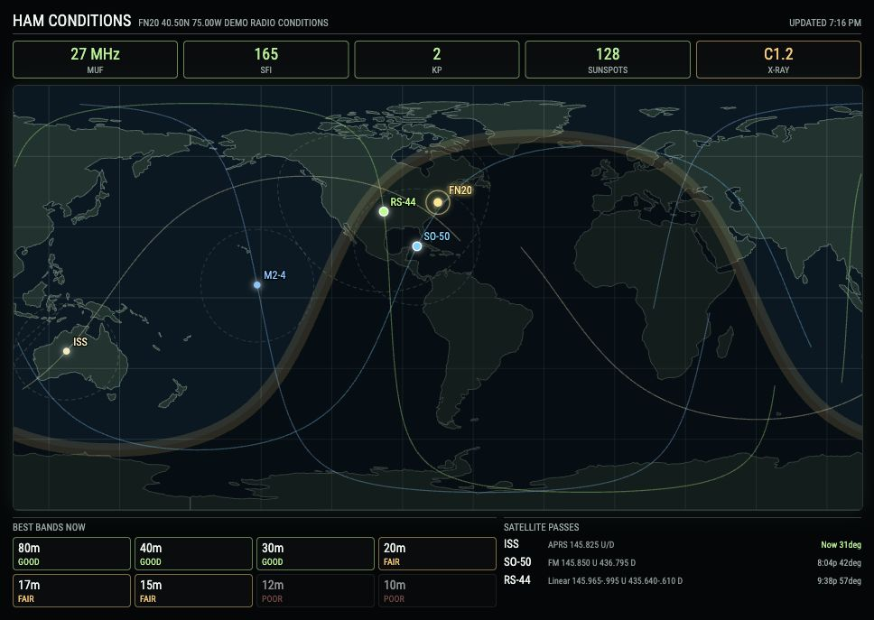

# MMM-HAM-Display

MagicMirror module for amateur-radio situational awareness: HF conditions, estimated MUF, solar indices, a greyline world map, a Maidenhead grid-square station marker, and configurable satellite tracks, footprints, passes, and radio frequencies.

The module is inspired by OpenHamClock and Geochron, but built as a normal MagicMirror module: live settings belong in `MagicMirror/config/config.js`, not in tracked module files.



## Install

Clone or copy this repository into your MagicMirror `modules` directory:

```bash
cd ~/MagicMirror/modules
git clone <repo-url> MMM-HAM-Display
```

## Update

To update an existing install:

```bash
cd ~/MagicMirror/modules/MMM-HAM-Display
git pull
```

Restart MagicMirror after updating so the new module files are loaded.

## Configure

Copy a module entry into the `modules` array in your MagicMirror `config/config.js`:

- [`config.example.js`](config.example.js) is a complete safe sample.
- [`examples/minimal-config.js`](examples/minimal-config.js) is a station-only starter.
- [`examples/satellite-config.js`](examples/satellite-config.js) includes satellite tracking.

Edit your station, satellites, sizing, timing, and display preferences in `config/config.js`. Do not edit tracked files in `modules/MMM-HAM-Display` for normal setup; those files may be replaced by `git pull`.

Minimal example:

```js
{
  module: "MMM-HAM-Display",
  position: "middle_center",
  config: {
    gridLocator: "FN20",
    stationCallsign: "N0CALL"
  }
}
```

Satellite display example:

```js
{
  module: "MMM-HAM-Display",
  position: "middle_center",
  config: {
    gridLocator: "FN20",
    stationCallsign: "N0CALL",
    width: 900,
    mapAspectRatio: 2,
    maxWidthVw: 90,
    mapUpdateInterval: 5000,
    maxPasses: 3,
    minElevation: 10,
    trackWavelengths: 1,
    trackStepMinutes: 1,
    satellites: [
      { name: "ISS", norad: 25544, color: "#f5e9b8", uplink: "145.825 MHz", downlink: "145.825 MHz", mode: "APRS" },
      { name: "SO-50", norad: 27607, color: "#61d6ff", uplink: "145.850 MHz", downlink: "436.795 MHz", mode: "FM", tone: "67.0 Hz" },
      { name: "RS-44", norad: 44909, color: "#a8ff80", uplink: "145.965-145.995 MHz", downlink: "435.640-435.610 MHz", mode: "Linear" },
      { name: "M2-4", norad: 59051, color: "#7bc7ff", downlink: "137.900 MHz", mode: "LRPT" }
    ]
  }
}
```

## Config Options

| Option | Default | Notes |
| --- | --- | --- |
| `gridLocator` | `""` | Maidenhead grid square for the station marker. Configure this in `config/config.js`; six characters is best. |
| `stationCallsign` | `""` | Optional station callsign label. When set, the map marker uses the callsign while the header still includes the grid square. |
| `satellites` | `[]` | List of satellites to track. Configure in `config/config.js`. Each item may include `name`, `norad`, `color`, `uplink`, `downlink`, `frequency`, `mode`, `tone`, `tleUrl`, or literal `tle`. |
| `width` | `900` | Preferred module width in pixels for center placement. |
| `height` | `450` | Optional height-based sizing value. If `fitWidthToHeight` is `true`, width is calculated from `height * mapAspectRatio`. If a user config sets only `height`, the module also uses height-based sizing for compatibility. |
| `mapAspectRatio` | `2` | Width divided by height for the world map. |
| `fitWidthToHeight` | `false` | Calculate width from `height * mapAspectRatio` instead of using `width` directly. |
| `maxWidthVw` | `90` | Maximum module width as viewport percentage. The final width is the smaller of `width` and this viewport cap. |
| `updateInterval` | `900000` | Solar and TLE data refresh interval in milliseconds. |
| `mapUpdateInterval` | `5000` | Greyline and satellite redraw interval in milliseconds. |
| `animationSpeed` | `0` | MagicMirror DOM update animation speed. |
| `timeoutMs` | `9000` | Network timeout for feed requests. |
| `solarCacheMs` | `600000` | Solar feed cache duration. |
| `tleCacheMs` | `21600000` | TLE cache duration. |
| `hamqslSolarUrl` | HamQSL solar XML | Solar data source URL. |
| `celestrakBaseUrl` | CelesTrak GP endpoint | Optional base URL for CelesTrak TLE lookup. |
| `landGeoJsonPath` | `assets/ne_110m_land.geojson` | Local Natural Earth land polygon file used for the world map. |
| `showHeader` | `true` | Show title, station, status, and updated time. |
| `showConditionStrip` | `true` | Show MUF, SFI, Kp, sunspots, and X-ray strip. |
| `showMap` | `true` | Show the map area. |
| `showGreyline` | `true` | Draw day, night, and greyline shading. |
| `showGraticule` | `true` | Draw latitude/longitude grid lines. |
| `showBandPanel` | `true` | Show the "Best Bands Now" panel. |
| `showSatellitePanel` | `true` | Show the satellite pass list. |
| `showSatelliteTracks` | `true` | Draw satellite ground tracks. |
| `showSatelliteFootprints` | `true` | Draw line-of-sight footprint circles. |
| `showSatelliteLabels` | `true` | Draw satellite names on the map. |
| `showPassFrequencies` | `true` | Show configured uplink/downlink/mode information in the pass list. |
| `maxPasses` | `3` | Number of upcoming satellite passes to display. |
| `passLookAheadHours` | `12` | Hours to scan for future satellite passes. |
| `passStepMinutes` | `2` | Minutes between samples used for pass prediction. |
| `minElevation` | `10` | Minimum elevation used for the next-pass list. |
| `trackWavelengths` | `1` | Satellite track length in orbital wavelengths. `1` draws one full ground-track wave centered on the current position. Set to `0` to use minute windows instead. |
| `trackMinutesBefore` | `10` | Previous ground-track minutes shown when `trackWavelengths` is `0`. |
| `trackMinutesAfter` | `30` | Future ground-track minutes shown when `trackWavelengths` is `0`. |
| `trackStepMinutes` | `1` | Minutes between points used to draw satellite tracks. Lower values look smoother. |
| `colors` | See defaults | Optional color overrides. Leave this in `config/config.js` if customized. |

## Satellite Config

Satellite entries normally use a NORAD catalog number:

```js
{ name: "SO-50", norad: 27607, color: "#61d6ff", uplink: "145.850 MHz", downlink: "436.795 MHz", mode: "FM", tone: "67.0 Hz" }
```

You may also provide a custom TLE URL:

```js
{ name: "Custom Sat", tleUrl: "https://example.com/tle.txt", color: "#ffffff" }
```

Or literal TLE lines:

```js
{
  name: "Custom Sat",
  tle: [
    "1 00000U 00000A   26001.00000000  .00000000  00000+0  00000+0 0  9990",
    "2 00000  00.0000 000.0000 0000000 000.0000 000.0000  1.00000000    00"
  ]
}
```

## Notes

- Solar data is loaded from HamQSL's public solar XML feed.
- Satellite TLE data is loaded from CelesTrak by NORAD catalog number unless a satellite entry provides `tleUrl` or literal `tle`.
- The satellite layer uses a lightweight orbital estimate suitable for a visual mirror display. It is not pass-grade SGP4 tracking software.
- If the solar feed does not include MUF, the module displays `MUF EST` using solar flux, sunspots, and Kp values.
- The included land polygons are from Natural Earth 110m data.

## Updating

Because live settings belong in `MagicMirror/config/config.js`, updating the module should not overwrite your station, satellite list, layout, or timing preferences:

```bash
cd ~/MagicMirror/modules/MMM-HAM-Display
git pull
```

Review `config.example.js` and `examples/` after updates if you want to see newly added options.
